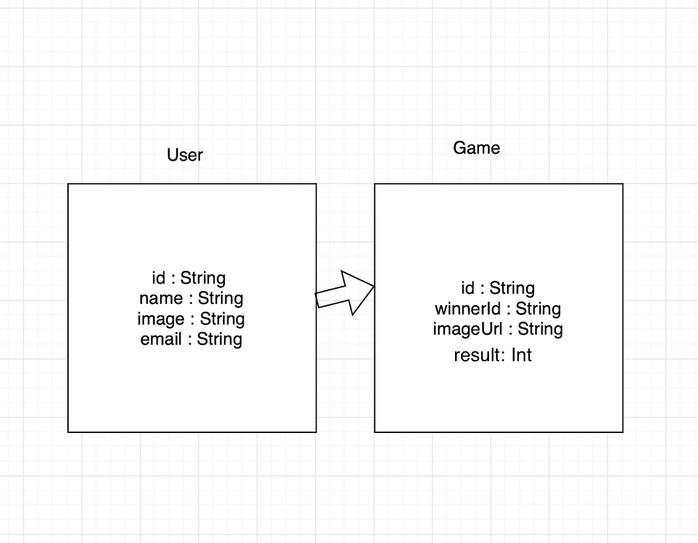

# balootCalculator

##  Description
- Baloot game application saves all the confrontations between the players and their results and the winner between them
 
## Demo

## user Stories
- user can make register & loge in.
- The user can log into his account and see the results of the games he played.
- The user can delete the games he played and update the user picture.
- The user can see the results.
 other users and the winner among them.

 ## Framework
 - UIKit
 - Firebase
 
  ## ERD
  

  
  ## wireframe 
   
   
